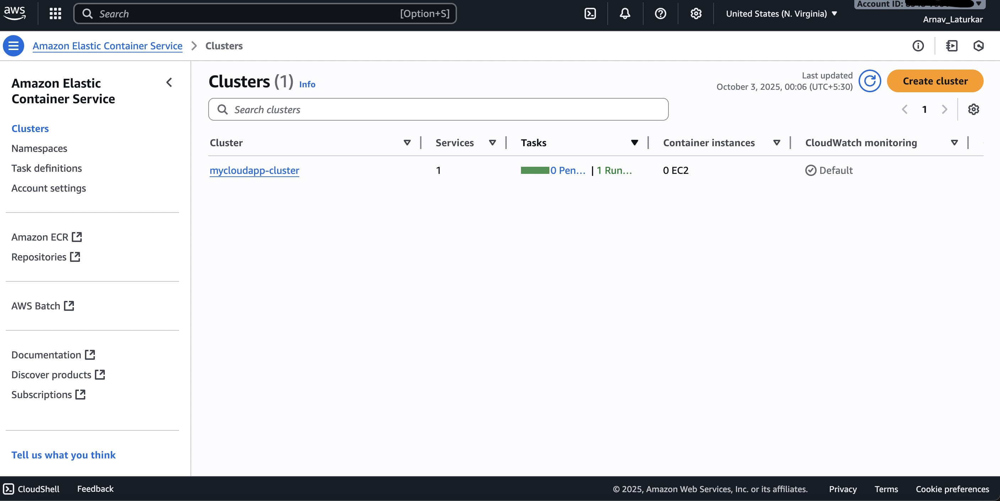
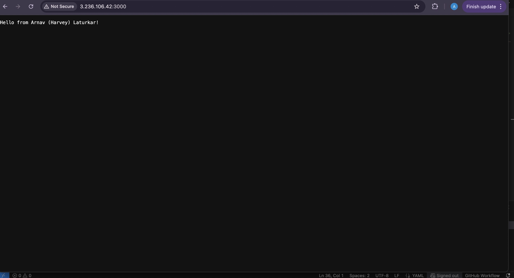

# AWS ECS Fargate Node.js App Deployment

## Project Overview

Welcome! This repository documents deploying a simple Node.js web application as a Docker container on AWS ECS Fargate. The goal: demonstrate hands-on experience with cloud-native deployment by packaging, storing, and running the app using modern AWS infrastructure and services.

---

## Architecture

- **Dockerized Node.js app** shipped to Amazon ECR.
- **AWS ECS (Fargate):** Orchestrates, scales, and runs the app with zero server management required.
- **Network:** Deployed to a public subnet, exposed on TCP port 3000, protected by AWS Security Group rules.
- **Logs:** Routed to AWS CloudWatch for easy access and diagnostics.

---

## How to Deploy

### 1. Build and Push Docker Image

### 2. Create or Update ECS Service

- Register ECS Task Definition using your ECR image.
- Launch an ECS Service using that Task Definition in a public subnet.
- Attach a Security Group with an inbound rule for TCP port 3000.

### 3. Access the Application

- Find the running task’s public IP.
- Access your app in a browser or with curl:

http://:3000

---

## Screenshots / Visual Evidence

Below are sample screenshots from the actual deployment process:

- **ECR Repository with pushed image:**
  

- **ECS Cluster and Service Running:**
  

- **Task Details (showing running task and network info):**
  

- **CloudWatch Logs (showing successful app start):**
  

- **Security Group with port 3000 open:**
  

- **App running in a browser:**
  

---

## Troubleshooting

- **App Not Reachable:**  
  - Ensure ECS service and task are healthy.
  - Confirm security group rules and subnet routing are correct.
  - Double-check public IP and port.
  - Review CloudWatch logs for status and error messages.

---
