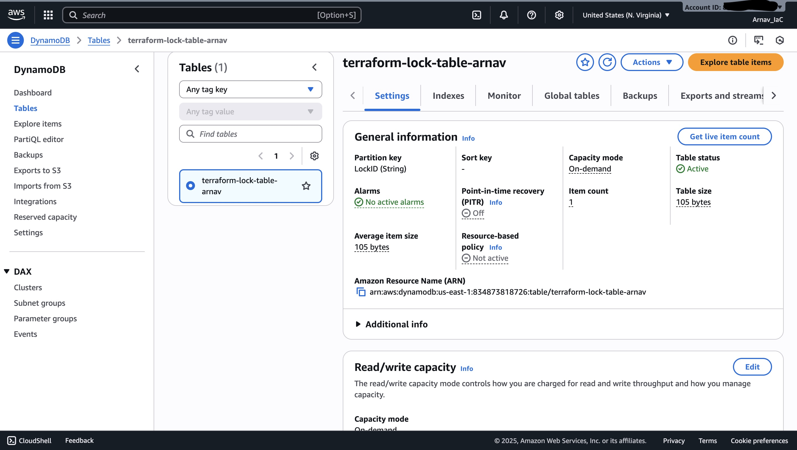

# Infrastructure Automation using Terraform Integrated with Github Actions

## Project Overview
This repository automates provisioning of core AWS infrastructure using Terraform, integrated with GitHub Actions. It demonstrates end-to-end infrastructure as code, remote state management, and automated deployments.

---

## Architecture
- **VPC & Networking**  
  - VPC with public and private subnets  
  - Internet Gateway  
- **State Backend**  
  - S3 bucket (versioning enabled)  
  - DynamoDB table for state locking   
- **CI/CD**  
  - GitHub Actions workflow initializes, formats, validates, plans, and applies Terraform.

---

# Deployment Flow

1. Prepare Terraform code  
   • Organize modules, variables, and backend configuration (S3 + DynamoDB).

2. Configure CI/CD credentials  
   • Add `AWS_ACCESS_KEY_ID_IAC` and `AWS_SECRET_ACCESS_KEY_IAC` as GitHub Secrets.

3. Trigger the pipeline  
   • Push to `main` or click **Run workflow** in Actions.  
   • Workflow stages: Checkout → Init → Fmt/Validate → Plan → Apply.

4. Verify infrastructure in AWS Console  
   • VPC & subnets (VPC service)  
   • Remote state backend (S3 bucket and DynamoDB table)  
   • Provisioned resources (IAM roles, compute, networking)

---

## Screenshots for PoC

1. **VPC**  
   

2. **Remote State Backend S3 Bucket**  
   

3. **Remote State Backend DyanamoDb Table**  
   

4. **Terraform EC2 instance**
   

5. **Pipeline Run Success**  
   

6. **Terraform Plan Output**  
   

7. **CI/CD Workflow**
   
---

# Troubleshooting

- **Checkout exit code 128**: remove or `.gitignore` empty dirs  
- **State backend errors**: enable S3 versioning; confirm table key  
- **Init failures**: verify backend config and AWS region/creds  
- **Plan/apply errors**: run `terraform fmt`/`validate` locally; inspect plan  
- **API limits**: check AWS quotas; rollback partial creates  
- **CI troubleshooting**: pin Action versions; cache plugins; add retries for IAM propagation  

